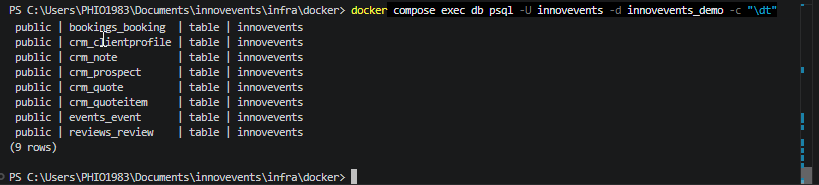
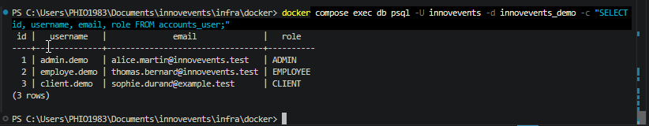
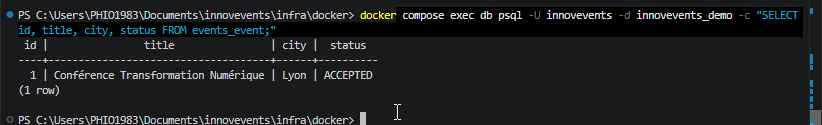

# Validation des scripts SQL

## 1. Objectif

Ce document présente les vérifications réalisées sur les scripts SQL de la base de données PostgreSQL.

Les tests ont permis de vérifier que :

- le schéma SQL peut être créé sur une base vide ;
- les tables attendues sont présentes ;
- les données de démonstration sont correctement insérées ;
- les utilisateurs de démonstration sont consultables ;
- l’événement de démonstration est correctement enregistré ;
- les caractères accentués sont correctement conservés.

---

## 2. Environnement de test

Les tests ont été réalisés avec :

- Docker ;
- Docker Compose ;
- PostgreSQL 16 ;
- le client `psql` ;
- PowerShell ;
- une base de données de démonstration nommée `innovevents_demo`.

Cette base de test est séparée de la base principale utilisée par l’application.

---

## 3. Scripts testés

| Script | Description | Résultat |
|---|---|---|
| `01_create_schema.sql` | Création des tables, contraintes et index | Validé |
| `02_insert_demo_data.sql` | Insertion des données de démonstration | Validé |

---

## 4. Création de la base de démonstration

La base de test a été créée avec la commande suivante :

```powershell
docker compose exec db psql -U innovevents -d postgres -c "CREATE DATABASE innovevents_demo;"
```

Résultat obtenu :

```text
CREATE DATABASE
```

---

## 5. Exécution du script de création

Le script de création a été copié dans le conteneur PostgreSQL :

```powershell
docker compose cp ..\..\Docs\database\01_create_schema.sql db:/tmp/01_create_schema.sql
```

Il a ensuite été exécuté avec :

```powershell
docker compose exec db psql -U innovevents -d innovevents_demo -f /tmp/01_create_schema.sql
```

L’exécution a produit les opérations suivantes sans erreur :

```text
BEGIN
CREATE TABLE
COMMENT
CREATE INDEX
COMMIT
```

---

## 6. Exécution du script d’insertion

Le script d’insertion a été copié dans le conteneur PostgreSQL :

```powershell
docker compose cp ..\..\Docs\database\02_insert_demo_data.sql db:/tmp/02_insert_demo_data.sql
```

Il a ensuite été exécuté avec :

```powershell
docker compose exec db psql -U innovevents -d innovevents_demo -f /tmp/02_insert_demo_data.sql
```

Le script a correctement exécuté :

- les instructions `INSERT` ;
- la mise à jour des séquences avec `setval` ;
- les requêtes de contrôle ;
- la validation de la transaction avec `COMMIT`.

---

## 7. Vérification des tables

La commande suivante a été utilisée pour afficher les tables créées :

```powershell
docker compose exec db psql -U innovevents -d innovevents_demo -c "\dt"
```

Le résultat confirme la présence des tables suivantes :

- `accounts_user` ;
- `bookings_booking` ;
- `crm_clientprofile` ;
- `crm_note` ;
- `crm_prospect` ;
- `crm_quote` ;
- `crm_quoteitem` ;
- `events_event` ;
- `reviews_review`.

### Capture de la liste des tables



---

## 8. Vérification des utilisateurs

La commande suivante a été utilisée :

```powershell
docker compose exec db psql -U innovevents -d innovevents_demo -c "SELECT id, username, email, role FROM accounts_user;"
```

Les trois utilisateurs de démonstration sont présents :

- un administrateur ;
- un employé ;
- un client.

### Capture des utilisateurs



---

## 9. Vérification de l’événement

La commande suivante a été utilisée :

```powershell
docker compose exec db psql -U innovevents -d innovevents_demo -c "SELECT id, title, city, status FROM events_event;"
```

Le résultat confirme la présence de l’événement de démonstration :

```text
Conférence Transformation Numérique
```

Les caractères accentués sont correctement affichés.

### Capture de l’événement



---

## 10. Problème d’encodage rencontré

Lors d’une première exécution avec un pipeline PowerShell, certains caractères accentués étaient mal affichés.

Exemple :

```text
Conf??rence Transformation Num??rique
```

Le problème venait du passage du contenu du fichier SQL dans PowerShell.

La solution a consisté à copier directement le fichier dans le conteneur avec :

```powershell
docker compose cp
```

Puis à demander à PostgreSQL de lire le fichier avec :

```powershell
psql -f
```

Cette méthode a permis de conserver correctement l’encodage UTF-8.

---

## 11. Organisation des fichiers

Le document doit être placé ici :

```text
Docs/database/validation-scripts-sql.md
```

Les trois captures doivent rester ici :

```text
Docs/captures/database/
├── extrait_demo_script_sql1.png
├── extrait_demo_script_sql2.png
└── extrait_demo_script_sql3.png
```

---

## 12. Conclusion

Les tests réalisés confirment que :

- le script de création fonctionne sur une base PostgreSQL vide ;
- les neuf tables attendues sont créées ;
- le script d’insertion fonctionne ;
- les utilisateurs de démonstration sont présents ;
- l’événement de démonstration est présent ;
- les caractères accentués sont correctement conservés ;
- les transactions SQL se terminent correctement avec `COMMIT`.

Les scripts `01_create_schema.sql` et `02_insert_demo_data.sql` sont donc considérés comme validés.